# MERCADAM

Vamos a crear una aplicación para gestionar un carrito de la compra. Consistirá en una zona para clientes, una muestra pequeña de productos para la prueba y generaremos automáticamente unos pocos usuarios para comprobar autenticaciones y que el programa funciona correctamente.

---

##### Índice

Diferentes

Enlaces

A

Partes

Del Proyecto

## 

## Diagrama

```mermaid
classDiagram
    class AppZonaClientes {
        -static Cliente cliente
        -static Scanner sc
        +main(args: String[])
        +autenticaion(clientes: List~Cliente~)
        +iniciarCompra()
        +imprimirProductos()
        +imprimirDespedida()
        +imprimirListaCantidad()
        -eliminarProducto()
        -queHacer()
        -resumenCompra()
    }
    
    class Cliente {
        -String usuario
        -String contrasena
        -String direccion
        -Pedido pedido
        -boolean promociones
        +Cliente(usuario: String, contrasena: String, direccion: String)
        +crearPedido()
        +getUsuario() String
        +getContrasena() String
        +getPedido() Pedido
        +getDireccion() String
        +setPromociones(b: boolean)
        +getPromociones() boolean
    }
    
    class Mercadam {
        -List~Cliente~ clientes
        -String[] nicks
        -String[] adjetivos
        +Mercadam()
        +generarClientes()
        +getClientes() List~Cliente~
    }
    
    class Pedido {
        -HashMap~Producto, Integer~ pedido
        -float importeTotal
        -boolean descuentosAplicados
        +Pedido()
        +aplicarPromo3x2()
        +aplicarPromo3x2(a: int)
        +aplicarPromo10()
        +aplicarPromo10(a: int)
        +addProducto(producto: Producto)
        -calcularImporteTotal()
        +getPedido() HashMap~Producto, Integer~
        +getImporteTotal() float
        +removeProducto(producto: Producto)
    }
    
    class Producto {
        <<enumeration>>
        MANZANAS
        PAN
        ARROZ
        POLLO
        LECHE
        ACEITE
        HUEVOS
        TOMATE
        PASTA
        -float precio
        +getPrecio() float
    }
    
    AppZonaClientes --> "1" Cliente: usa
    AppZonaClientes --> "1" Mercadam: usa
    Cliente --> "1" Pedido: tiene
    Pedido --> "*" Producto: contiene
    Mercadam --> "*" Cliente: contieneclassDiagram
direction BT
class AppZonaClientes {
  + AppZonaClientes() 
  - resumenCompra() void
  - queHacer() void
  + iniciarCompra() void
  + imprimirDespedida() void
  - eliminarProducto() void
  + imprimirListaCantidad() void
  + imprimirProductos() void
  + main(String[]) void
  + autenticaion(List~Cliente~) void
}
class Cliente {
  + Cliente(String, String, String) 
  - String usuario
  - String contrasena
  - String direccion
  - Pedido pedido
  - boolean promociones
  + crearPedido() void
  + toString() String
   String usuario
   boolean promociones
   String direccion
   Pedido pedido
   String contrasena
}
class Mercadam {
  + Mercadam() 
  - List~Cliente~ clientes
  + generarClientes() void
   List~Cliente~ clientes
}
class Pedido {
  + Pedido() 
  - HashMap~Producto, Integer~ pedido
  - float importeTotal
  + removeProducto(Producto) void
  + aplicarPromo3x2(int) void
  + aplicarPromo10() void
  + aplicarPromo3x2() void
  + aplicarPromo10(int) void
  - calcularImporteTotal() void
  + addProducto(Producto) void
   HashMap~Producto, Integer~ pedido
   float importeTotal
}
class Producto {
<<enumeration>>
  - Producto(float) 
  - float precio
  + values() Producto[]
  + valueOf(String) Producto
   float precio
}


```

