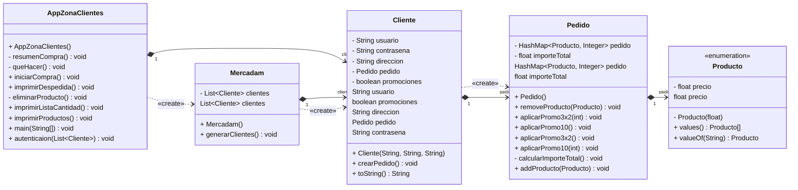

# MERCADAM

Vamos a crear una aplicación para gestionar un carrito de la compra. Consistirá en una zona para clientes, una muestra pequeña de productos para la prueba y generaremos automáticamente unos pocos usuarios para comprobar autenticaciones y que el programa funciona correctamente.

---

### Índice

[Diagrama](#Diagrama)

Enlaces

A

Partes

Del Proyecto

---

## Comentario

Aún que el desarrollo del programa fue desarrollando todas las clases al mismo tiempo, vamos a realizar el comentario del proyecto según dependencias.

### AppZonaClientes

Siendo la *app* principal, es la clase que madre del programa. Desde aquí se instancia el ochenta por ciento del programa.

```java
private static Cliente cliente;
private static Scanner sc = new Scanner(System.in);
```

Vamos a almacenar un único cliente y instanciar estáticamente la clase Scanner.

#### main

```java
public static void main(String[] args) {
        Mercadam mercadam = new Mercadam();
        List<Cliente> clientes = mercadam.getClientes();

        autenticaion(clientes);
        System.out.println("BIENVENID@ " + cliente.getUsuario() + "!"
        + "\nAñade productos a tu carrito de la compra...\n");

        imprimirProductos();
        iniciarCompra();
```

En la primera linea del main se va a sostener la gran parte del programa. A continuación llamaremos a los clientes que se generan en `mercadam`. Mercadam, al ser inicializada va a generar una cantidad limitada de usuarios que serán mostrados por pantalla.
Una vez seleccionado el usuario generado con el que queremos realizar la compra lo autenticaremos, la app nos dará la bienvenida, imprimirá los productos por pantalla y nos permitirá iniciar la compra.

```java
String anadirProductos = "S";
String producto = "";
Producto productoSelec = null;
do{
    System.out.print("\tElige un producto:");
    producto = sc.nextLine();
    System.out.println("~~~~~~~~~~~~~~~~~~~~~~~~~~~~~~~~~~~~~~~~~~~~~~~~~~");

    try {
        productoSelec = Producto.valueOf(producto.toUpperCase());
        cliente.getPedido().addProducto(productoSelec);

    } catch (IllegalArgumentException e) {
        System.out.println("Producto no encontrado. Intente de nuevo.");
        productoSelec = null;
    }

    if (productoSelec == null){ //evita un nullpointer
        continue;
    }

    System.out.println("Has añadido " + productoSelec.name() + " con un precio de "
            + productoSelec.getPrecio() + "€." +
            "\nImporte total del carrito: " + cliente.getPedido().getImporteTotal() + "€.");

    do {
        System.out.println("¿Quieres añadir más productos al carrito de la compra? [S/N]");
        anadirProductos = sc.nextLine().toUpperCase();
        if (!anadirProductos.equals("S") && !anadirProductos.equals("N")) {
            System.out.println("\t► Entrada no reconocida");
        }

    } while (!anadirProductos.equals("S") && !anadirProductos.equals("N") );

    if (anadirProductos.equals("S")){
        System.out.println();
        imprimirProductos();
    }

} while (anadirProductos.equals("S"));
```

Aquí podemos observar dos bloques principales **do-while**, en el primer bloque, que contiene el segundo, vamos a controlar que se quieren añadir productos a la lista de la compra. Para ello le pediremos al usuario que introduzca por pantalla una cadena de texto, que pasaremos a mayúsculas para cotejarla con el *enum* de los productos disponibles.

Para no alargar el  bloque *try* de forma innecesaria, vamos a  añadir un *continue* nada más salir para que no intente seleccionar el nombre, y precio de un producto que no existe, pasando así a la siguiente iteración del bloque *do-while*.

```java
try {
        productoSelec = Producto.valueOf(producto.toUpperCase());
        cliente.getPedido().addProducto(productoSelec);

    } catch (IllegalArgumentException e) {
        System.out.println("Producto no encontrado. Intente de nuevo.");
        productoSelec = null;
    }

    if (productoSelec == null){ 
        continue;
    }
```

En el *do-while* anidado, simplemente comprobaremos que la entrada del usuario se encuentra limitada a los caracteres de respuesta binarios, *Si* o *No* (S/N).

Si no se ha dado ningún problema hasta ahora, se imprimirá cómo está resultando la compra `resumenCompra();`.

Continuaremos con el segundo gran bloque de la app principal:

```java
boolean exit = false;
do {
    queHacer();
    switch (sc.nextInt()){
        case 1 -> {
            if (cliente.getPedido().getPedido().isEmpty()){
                System.out.println("No hay productos en el carrito");
                break;
            } else if (cliente.getPromociones()){
                System.out.println("Ya has aplicado las promociones");
                break;
            } else {
                System.out.println("\n~~~~~~~~~~~~~~~~~~~~~~~~~~~~~~~~~~~\n");
                cliente.getPedido().aplicarPromo3x2();
                cliente.getPedido().aplicarPromo10();
                cliente.setPromociones(true);
                System.out.println("~~~~~~~~~~~~~~~~~~~~~~~~~~~~~~~~~~~\n");
            }
        }
        case 2 -> imprimirListaCantidad();
        case 3 -> eliminarProducto();
        case 4 -> {
            System.out.println("Pedido terminado");
            exit = true;
        }
        default -> System.out.println("Opción no válida");
    }

} while (!exit);
```

Definiremos una *boolena* para salir del bloque *do-while* que nos permitirá gestionar nuestro pedido. Imprimirá un pequeño menú en el que se nos mostrarán diferentes opciones que serán gestionadas en el *switch*.

La primera opción será aplicar las promociones al pedido, para asegurarnos que no hay errores, comprobaremos que hay productos en el carrito y si el usuario dispone de promociones.
La segunda opción nos permite imprimir en pantalla la lista de productos en orden según la cantidad de productos comprados, la tercera opción, eliminar un producto,y la cuarta nos permite romper el bucle y salir.

Para acabar el ***main***, nos despediremos amablemente del usuario `imprimirDespedida();`.

#### autenticacion(clientes)

Para autenticar al usuario, comprobaremos en un bucle for que su contraseña y usuario coinciden. Si es así, asignaremos a la variable cliente, el cliente. Si no, sumaremos un intento a la variable *intento*. Cuando esta variable pase del tercer intento nos sacará del programa indicándonos que hemos excedido la cantidad de intentos.

```java
public static void autenticacion(List<Cliente> clientes){
    int intento = 0;
    do {
        System.out.println("Introduce tu usuario");
        String usuario = sc.nextLine();
        System.out.println("Introduce tu contraseña");
        String contrasena = sc.nextLine();

        for (Cliente c : clientes) {
            if (c.getUsuario().equals(usuario) && c.getContrasena().equals(contrasena)) {
                System.out.println("Usuario encontrado!\n");
                cliente = c;
                break;
            }
        }

        if (cliente == null) {
            System.out.println("Usuario no encontrado! Vuelve a intentarlo...\n");
        }
        intento++;


    } while (intento <= 3 && cliente == null);

    if (cliente == null){
        System.out.println("ERROR DE AUTENTICACION");
        System.exit(0);
    }
}
```

#### imprimirProductos()

```java
public static void imprimirProductos(){
    String lineaHorizontal = "╔═══════════════════════════════════════════╗";
    System.out.println(lineaHorizontal);
    System.out.println("║ Productos disponibles:                    ║");
    for (Producto p : Producto.values()){
        String linea = String.format("║ \t► %-15s precio (%-5.2f€)", p.name(), p.getPrecio());
        while (linea.length() < lineaHorizontal.length() - 2) {
            linea += " ";
        }
        System.out.println(linea + "║");
    }
    System.out.println("""
            ║                                           ║
            ╚═══════════════════════════════════════════╝""");
}
```

Para imprimir los productos les daremos un formato para mostrar su nombre y precio de forma clara y fácil de leer. Nos aseguraremos de que el formato se mantiene constante gracias a `String.format` donde  también tendremos en cuenta la longitud de la línea actual para cerrar el bloque correctamente.

##### String.format

```java
String linea = String.format("║ \t► %-15s precio (%-5.2f€)", p.name(), p.getPrecio());
```

Es un método estático de String que nos permite usar características especiales similares a leguajes C.

- `%-15s` nos permitirá reservarle 15 caracteres a la izquierda, lo cual definiremos con el carácter `-`, a un String `s`.
- `%-5.2f` nos permitirá reservarle 5 caracteres también a la izquierda a un numero flotante `f` y formatearlo a dos decimales.

A continuación, asignaría las variables `p.name()` y `p.getPrecio()` en su hueco correspondiente.

#### iniciarCompra()

Simplemente lanzará `crearPedido()` dentro del cliente ya asignado.

```java
public static void iniciarCompra(){
        cliente.crearPedido();
}
```

#### resumenCompra()

Mostrará en formato de ticket el estado actual del pedido, incluyendo el nombre del producto, la cantidad y el precio total.
Para el formato, esta vez emplearemos *print formatted* `printf`, cual cuyo nombre indica permite darle formato al texto.

```java
private static void resumenCompra() {
    System.out.println("\n" +"~~~~~~~~~~~~~~~~~~~~~~~~~~~~~~~~~~~\n" +
                             "RESUMEN DEL CARRITO DE TU COMPRA:\n\n" +
                             "Producto\t\tCantidad\tPrecio\n");

    for (Producto p : cliente.getPedido().getPedido().keySet()){
        int cantidad = cliente.getPedido().getPedido().get(p);
        float precioTotal = p.getPrecio() * cantidad;
        System.out.printf("%-15s\t%5d\t  %7.2f€%n",
                p.name(),
                cantidad,
                precioTotal);
    }

    System.out.println("TOTAL A PAGAR " + cliente.getPedido().getImporteTotal() + "€\n~~~~~~~~~~~~~~~~~~~~~~~~~~~~~~~~~~~\n");
}
```

##### printf Cheat-Sheet

- `%-[num]s`: Reserva `[num]` caracteres para el nombre `s` del producto, alineado a la izquierda `-`
- `%[num]d`: Reserva `[num]` caracteres para la cantidad  `d`, alineado a la derecha
- `%[num].[floatNum]f€`: Reserva `[num]` caracteres para el precio con `[floatNum]` decimales, alineado a la derecha
- `%n`: Inserta un salto de línea

#### queHacer()

Es una clase casi residual, empleada únicamente para imprimir un menú para dar la indicación de *que hacer* a continuación, la cual da pie al *switch* del *main*

#### imprimirListaCantidad()

```java
public static void imprimirListaCantidad() {
    System.out.println("\nPRODUCTOS ORDENADOS POR CANTIDAD:");
    System.out.println("Producto\t\tCantidad\tPrecio");

    List<Map.Entry<Producto, Integer>> entradas = new ArrayList<>(cliente.getPedido().getPedido().entrySet());

    entradas.sort(new Comparator<Map.Entry<Producto, Integer>>() {
        public int compare(Map.Entry<Producto, Integer> entrada1, Map.Entry<Producto, Integer> entrada2) {
            return entrada2.getValue().compareTo(entrada1.getValue());
        }
    });

    for (Map.Entry<Producto, Integer> entrada : entradas) {
        Producto producto = entrada.getKey();
        Integer cantidad = entrada.getValue();
        System.out.printf("%-15s\t%5d\t  %7.2f€%n",
                producto.name(),
                cantidad,
                producto.getPrecio() * cantidad);
    }

    System.out.println("\nTOTAL A PAGAR: " + cliente.getPedido().getImporteTotal() + "€");
    }
}
```

Una clase copiada y modificada en el que la novedad es llamar al *Comparator* para hacer una ordenación de una "lista de mapas" .

```java
List<Map.Entry<Producto, Integer>> entradas = new ArrayList<>(cliente.getPedido().getPedido().entrySet());
```

En el `compare` vamos a introducir dos parámetros `Map.Entry<Producto, Integer>`: `entrada1` y `entrada2`. Esto hará que al comparar los mapas extraiga el *valor* de cada uno de ellos y los compare.

```java
entradas.sort(new Comparator<Map.Entry<Producto, Integer>>() {
        public int compare(Map.Entry<Producto, Integer> entrada1, Map.Entry<Producto, Integer> entrada2) {
            return entrada2.getValue().compareTo(entrada1.getValue());
        }
    });
```

```java
return entrada2.getValue().compareTo(entrada1.getValue());
```

Extraeremos el valor comparado de ambas entradas, lo cuál hará en orden descendente, permitiendo almacenar en orden descendente los valores de los productos en la *lista* de *HashMaps* `entradas`, para a continuación ser recorrido.

## Diagrama


